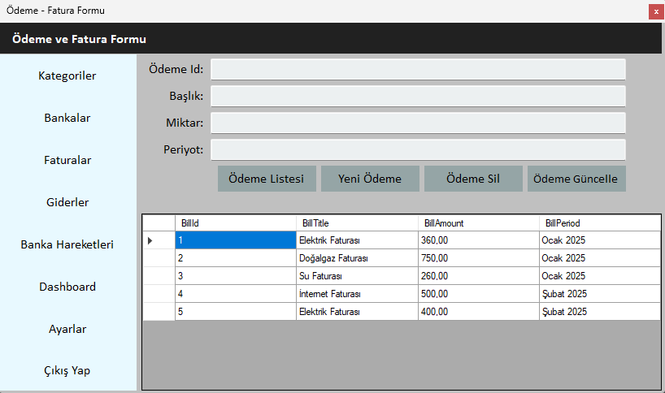

# FinancialCrm

FinancialCrm, finansal işlemleri ve kullanıcı yönetimini kolaylaştıran bir CRM uygulamasıdır. Uygulama, kullanıcı girişinden finansal verilerin görselleştirilmesine kadar çeşitli özellikler sunar.

## Formlar ve İşlevleri

### FrmLogin

FrmLogin formu, kullanıcıların sisteme giriş yapmasını sağlar. Kullanıcı adı ve şifre doğru girildiğinde, veritabanındaki `Users` tablosu ile doğrulama yapılır ve başarılı girişte kullanıcıya "Hoşgeldiniz" mesajı gösterilip `FrmDashboard` formuna yönlendirilir. Yanlış bilgiler girildiğinde ise hata mesajı görüntülenir. Ayrıca, yeni kullanıcı kaydı oluşturmak için `FrmSignIn` formuna yönlendiren bir buton da bulunmaktadır.

---

### FrmSignIn

FrmSignIn formu, yeni kullanıcı kaydı oluşturmak için kullanılır. Kullanıcı adı ve şifreyi girdikten sonra, veritabanına yeni bir kullanıcı ekler ve kaydın başarılı olması durumunda kullanıcıya "Kullanıcı başarıyla kaydedildi" mesajı gösterilir. Formda, tüm alanların doldurulması gerektiği kontrol edilerek eksik bilgiler için uyarı yapılır. Başarılı kayıttan sonra, form kapanır ve `FrmLogin` formu gösterilir.

---

### FrmDashboard

FrmDashboard, kullanıcının finansal verilerini görselleştiren ana paneldir. Toplam banka bakiyesi, son banka işlemi ve grafiklerle banka bakiyeleri ve faturalar gösterilir. Ayrıca, faturalar her 4 saniyede bir güncellenir. Kullanıcı, diğer modüllere geçiş yapabilir ve çıkış yapma işlemini onaylayarak uygulamayı kapatabilir.

---

### FrmCategories

FrmCategories, kategorilerin yönetildiği formdur. Bu formda kullanıcı, mevcut kategorileri görüntüleyebilir, yeni kategori ekleyebilir, mevcut kategorileri güncelleyebilir ve silebilir. Kategori ekleme, silme ve güncelleme işlemleri gerçekleştikten sonra, kategoriler otomatik olarak güncellenir ve veri tabanındaki değişiklikler yansıtılır.

---

### FrmBanks

FrmBanks, banka hesaplarının bakiyelerinin görüntülendiği ve banka işlemlerinin takip edildiği bir formdur. Bu formda, Ziraat Bankası, Vakıfbank, İş Bankası, Yapıkredi, Denizbank ve Akbank gibi bankaların mevcut bakiyeleri görüntülenir. Ayrıca, son 5 banka işlemine dair açıklama, tutar ve tarih bilgileri de bu formda yer alır.

---

### FrmBilling

FrmBilling, faturaların eklendiği, güncellendiği ve silindiği bir formdur. Kullanıcılar, faturaların başlık, tutar ve dönem bilgilerini girip, listeyi görüntüleyebilir. Yapılan işlemler veritabanına kaydedilip, kullanıcıya bildirilir.

---

### FrmBankProcesses

FrmBankProcesses formu, banka işlemleri ile ilgili verileri görüntülemeye, silmeye ve yönetmeye olanak tanır. Form, kullanıcıya bankalardaki işlem bilgilerini sunar. Banka işlem kaydını silmek için, kullanıcı seçilen satırdaki işlemi seçebilir ve silme işlemi başarılıysa, sistem kullanıcıyı bilgilendirir. Formda ayrıca, farklı ekranlara geçiş sağlayan butonlar da bulunmaktadır.

---

### FrmSettings

FrmSettings formu, kullanıcıların veritabanı yedekleme, şifre değiştirme ve ana panele geri dönme gibi işlemleri gerçekleştirmesini sağlar. Kullanıcı, "Yedek Al" seçeneğiyle veritabanını belirttiği bir konuma yedekleyebilir. "Şifre Değiştir" özelliği, mevcut şifreyi doğrulayarak yeni şifreyi kaydetme imkânı sunar. Ayrıca, ana panele dönüş ve uygulamadan güvenli bir şekilde çıkış yapma seçenekleri mevcuttur.

---
